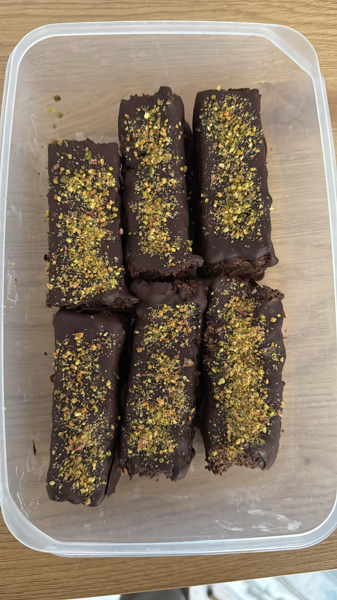

# Protein Bars

## Ingredients

| Ingredient | Quantity | Notes |
|---|---|---|
| Medjool dates | 135g | Roughly chopped |
| Peanut butter | 340g | Crunchy — [Maxim's (Selgros)](https://www.selgros.ro/exploreaza-sortimentul-selgros/product/maxims-unt-de-arahide-340g-1068489) |
| Protein powder | 170g | [Sportness Vegan Choco (dm)](https://www.dm.ro/sportness-shake-proteic-vegan-cu-ciocolata-p4067796180220.html) |
| Almonds | 135g | Ground |
| Chia seeds | 100g | Milled |
| Maple syrup | 3 tbsp | |
| Water | 290ml | See notes — 240ml was too dense |
| Dark chocolate (80%) | 200g | |

## Original proportions (for 250g peanut butter)

| Ingredient | Quantity |
|---|---|
| Medjool dates | 100g |
| Peanut butter | 250g |
| Protein powder | 125g |
| Almonds | 100g |
| Chia seeds | 75g |
| Maple syrup | 2 tbsp |
| Water | 175ml |
| Dark chocolate (80%) | 150g |

## Equipment

- 20x20cm baking tin
- Parchment paper
- Food processor
- Wire rack + baking tray

## Method

1. Line a 20x20cm baking tin with parchment paper.
2. Pour a small amount of boiling water over the chopped dates. Soak ~10 minutes, then mash with a fork or potato masher into a spreadable paste.
3. Combine peanut butter, protein powder, ground almonds, milled chia seeds, maple syrup, and water in a food processor. Blend until smooth.
4. Transfer mixture to the tin, press down firmly with the back of a spoon. Spread the date paste evenly on top.
5. Refrigerate for 30 minutes until firm. Slice into 12 bars.
6. Melt dark chocolate in a bowl over simmering water (don't let the bowl touch the water).
7. Dip each bar into melted chocolate, place on a wire rack over a baking tray to drip. Sprinkle toppings while still wet. Let set 5-10 minutes.

## Nutrition (estimated)

Total batch: ~5645 kcal | 285g protein | 360g carbs | 362g fat | 89g fibre

| Serving size | Bars | kcal | Protein | Carbs | Fat | Fibre |
|---|---|---|---|---|---|---|
| **per 100g** | — | 395 | 19.9g | 25.2g | 25.3g | 6.2g |
| ~120g (current) | 12 | 470 | 23.8g | 30.0g | 30.2g | 7.4g |
| ~90g | 16 | 353 | 17.8g | 22.5g | 22.6g | 5.6g |
| ~72g | 20 | 282 | 14.3g | 18.0g | 18.1g | 4.5g |

Nutrition sources

- Protein powder: [Sportness Vegan Choco — Open Food Facts](https://world.openfoodfacts.org/product/4067796180220) — 76g protein, 3.5g carbs, 3.5g fat per 100g
- Peanut butter: [Maxim's — Open Food Facts](https://world.openfoodfacts.org/product/5290426200268/unt-de-arahide-maxim-s) — 26g protein, 22g carbs, 49g fat per 100g
- Other ingredients: standard USDA values
- 3 tbsp maple syrup ≈ 60g

## Storage

- Keeps up to 2 weeks in the fridge
- Freezer friendly

## Notes

- Source: [The Doctor's Kitchen](https://www.thedoctorskitchen.com/recipes/dr-rupy-s-no-bake-protein-bar)
- Scaled up from original (250g PB → 340g PB, factor 1.36x)

### Iteration log

**Batch 1** — Too dense. Needed ~50ml extra water (240ml → 290ml). Servings were too big at 12 bars. Next time: cut into smaller bars (16-20) and increase dark chocolate for better coating coverage.

## Photos

